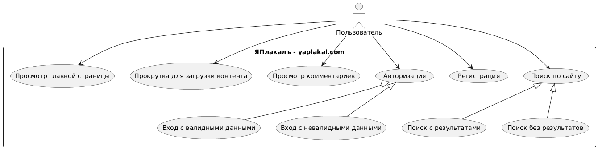

# Отчет по лабораторной работе №3

## Задание

Сформировать варианты использования, разработать на их основе тестовое покрытие и провести функциональное тестирование интерфейса сайта ЯПлакалъ (http://www.yaplakal.com/).

## Требования к выполнению работы:

1. Тестовое покрытие должно быть сформировано на основании набора прецедентов использования сайта.
2. Тестирование должно осуществляться автоматически - с помощью системы автоматизированного тестирования Selenium.
3. Шаблоны тестов должны формироваться при помощи Selenium IDE и исполняться при помощи Selenium RC в браузерах Firefox и Chrome.
4. Предполагается, что тестируемый сайт использует динамическую генерацию элементов на странице, т.е. выбор элемента в DOM должен осуществляться не на основании его ID, а с помощью XPath.

## 1. UseCase-диаграмма с прецедентами использования тестируемого сайта

### Прецеденты использования:

1. **Просмотр главной страницы** - пользователь открывает главную страницу сайта и просматривает доступный контент.
2. **Авторизация пользователя** - пользователь входит в систему, используя логин и пароль.
3. **Регистрация нового пользователя** - новый пользователь создает учетную запись.
4. **Поиск контента** - пользователь ищет информацию на сайте, используя строку поиска.
5. **Просмотр тем форума** - пользователь открывает и просматривает содержимое тем на форуме.
6. **Просмотр правил форума** - пользователь просматривает правила использования форума.

## 2. CheckList тестового покрытия

| ID  | Тест-кейс                                       | Приоритет | Ожидаемый результат                                      |
|-----|------------------------------------------------|-----------|--------------------------------------------------------|
| 1   | Проверка загрузки главной страницы              | Высокий   | Главная страница загружается корректно                   |
| 2   | Проверка доступности ссылки на авторизацию       | Высокий   | Переход на страницу авторизации работает                 |
| 3   | Проверка доступности ссылки на поиск             | Высокий   | Переход на страницу поиска работает                      |
| 4   | Проверка наличия разделов форума                | Высокий   | Разделы форума отображаются на главной странице          |
| 5   | Проверка перехода на страницу регистрации        | Высокий   | Переход на страницу регистрации работает                 |
| 6   | Проверка формы поиска                           | Средний   | Форма поиска отображается корректно                      |
| 7   | Выполнение поиска                               | Средний   | Поиск выполняется и отображаются результаты              |
| 8   | Проверка результатов поиска                     | Средний   | Результаты поиска содержат искомый текст                 |
| 9   | Проверка пустого поиска                         | Низкий    | При пустом запросе отображается соответствующее сообщение |
| 10  | Отображение формы входа                         | Высокий   | Форма входа отображается корректно                       |
| 11  | Попытка входа с неверными данными               | Высокий   | Система выдает сообщение об ошибке                       |
| 12  | Проверка полей формы входа                      | Средний   | Поля формы входа принимают введенные данные              |
| 13  | Открытие темы форума                            | Высокий   | Тема форума открывается и отображается                   |
| 14  | Просмотр содержимого темы                       | Высокий   | Содержимое темы отображается корректно                   |
| 15  | Проверка первого поста в теме                   | Средний   | Первый пост темы отображается корректно                  |
| 16  | Отображение формы регистрации                   | Высокий   | Форма регистрации отображается корректно                 |
| 17  | Проверка полей формы регистрации                | Средний   | Поля формы регистрации принимают введенные данные        |
| 18  | Регистрация с паролями, которые не совпадают     | Средний   | Система выдает сообщение об ошибке                       |
| 19  | Просмотр правил форума                          | Средний   | Правила форума отображаются корректно                    |
| 20  | Возврат на главную страницу                     | Низкий    | Возврат на главную страницу работает                     |

## 3. Описание набора тестовых сценариев

### Тестирование главной страницы
- **Тест 1**: Проверяем, что главная страница загружается, отображается главное меню и присутствует корректный заголовок.
- **Тест 2**: Проверяем, что ссылка на авторизацию доступна и ведет на правильную страницу.
- **Тест 3**: Проверяем, что ссылка на поиск доступна и ведет на правильную страницу.
- **Тест 4**: Проверяем, что на главной странице присутствуют разделы форума.
- **Тест 5**: Проверяем, что ссылка на регистрацию доступна и ведет на правильную страницу.

### Тестирование поиска
- **Тест 6**: Проверяем, что форма поиска отображается корректно.
- **Тест 7**: Проверяем, что поиск выполняется и отображаются результаты.
- **Тест 8**: Проверяем содержимое результатов поиска.
- **Тест 9**: Проверяем поведение системы при выполнении пустого поиска.

### Тестирование авторизации
- **Тест 10**: Проверяем корректность отображения формы входа.
- **Тест 11**: Проверяем поведение системы при попытке входа с неверными данными.
- **Тест 12**: Проверяем корректность работы полей формы входа.

### Тестирование просмотра тем
- **Тест 13**: Проверяем возможность открытия темы форума.
- **Тест 14**: Проверяем корректность отображения содержимого темы.
- **Тест 15**: Проверяем корректность отображения первого поста в теме.

### Тестирование регистрации
- **Тест 16**: Проверяем корректность отображения формы регистрации.
- **Тест 17**: Проверяем корректность работы полей формы регистрации.
- **Тест 18**: Проверяем поведение системы при вводе паролей, которые не совпадают.

### Тестирование правил форума
- **Тест 19**: Проверяем корректность отображения правил форума.
- **Тест 20**: Проверяем работу возврата на главную страницу.

## 4. Результаты тестирования

### Тестирование в браузере Chrome

| ID  | Тест-кейс                                       | Результат | Комментарий                                              |
|-----|------------------------------------------------|-----------|----------------------------------------------------------|
| 1   | Проверка загрузки главной страницы              | Пройден   | Главная страница загружается корректно                   |
| 2   | Проверка доступности ссылки на авторизацию       | Пройден   | Переход на страницу авторизации работает                 |
| 3   | Проверка доступности ссылки на поиск             | Пройден   | Переход на страницу поиска работает                      |
| 4   | Проверка наличия разделов форума                | Пройден   | Разделы форума отображаются на главной странице          |
| 5   | Проверка перехода на страницу регистрации        | Пройден   | Переход на страницу регистрации работает                 |
| 6   | Проверка формы поиска                           | Пройден   | Форма поиска отображается корректно                      |
| 7   | Выполнение поиска                               | Пройден   | Поиск выполняется и отображаются результаты              |
| 8   | Проверка результатов поиска                     | Пройден   | Результаты поиска содержат искомый текст                 |
| 9   | Проверка пустого поиска                         | Пройден   | При пустом запросе система остается на странице поиска   |
| 10  | Отображение формы входа                         | Пройден   | Форма входа отображается корректно                       |
| 11  | Попытка входа с неверными данными               | Пройден   | Система не позволяет войти с неверными данными           |
| 12  | Проверка полей формы входа                      | Пройден   | Поля формы входа принимают введенные данные              |
| 13  | Открытие темы форума                            | Пройден   | Тема форума открывается и отображается                   |
| 14  | Просмотр содержимого темы                       | Пройден   | Содержимое темы отображается корректно                   |
| 15  | Проверка первого поста в теме                   | Пройден   | Первый пост темы отображается корректно                  |
| 16  | Отображение формы регистрации                   | Пройден   | Форма регистрации отображается корректно                 |
| 17  | Проверка полей формы регистрации                | Пройден   | Поля формы регистрации принимают введенные данные        |
| 18  | Регистрация с паролями, которые не совпадают     | Пройден   | Система не позволяет зарегистрироваться с несовпадающими паролями |
| 19  | Просмотр правил форума                          | Пройден   | Правила форума отображаются корректно                    |
| 20  | Возврат на главную страницу                     | Пройден   | Возврат на главную страницу работает                     |

### Тестирование в браузере Firefox

| ID  | Тест-кейс                                       | Результат | Комментарий                                              |
|-----|------------------------------------------------|-----------|----------------------------------------------------------|
| 1   | Проверка загрузки главной страницы              | Пройден   | Главная страница загружается корректно                   |
| 2   | Проверка доступности ссылки на авторизацию       | Пройден   | Переход на страницу авторизации работает                 |
| 3   | Проверка доступности ссылки на поиск             | Пройден   | Переход на страницу поиска работает                      |
| 4   | Проверка наличия разделов форума                | Пройден   | Разделы форума отображаются на главной странице          |
| 5   | Проверка перехода на страницу регистрации        | Пройден   | Переход на страницу регистрации работает                 |
| 6   | Проверка формы поиска                           | Пройден   | Форма поиска отображается корректно                      |
| 7   | Выполнение поиска                               | Пройден   | Поиск выполняется и отображаются результаты              |
| 8   | Проверка результатов поиска                     | Пройден   | Результаты поиска содержат искомый текст                 |
| 9   | Проверка пустого поиска                         | Пройден   | При пустом запросе система остается на странице поиска   |
| 10  | Отображение формы входа                         | Пройден   | Форма входа отображается корректно                       |
| 11  | Попытка входа с неверными данными               | Пройден   | Система не позволяет войти с неверными данными           |
| 12  | Проверка полей формы входа                      | Пройден   | Поля формы входа принимают введенные данные              |
| 13  | Открытие темы форума                            | Пройден   | Тема форума открывается и отображается                   |
| 14  | Просмотр содержимого темы                       | Пройден   | Содержимое темы отображается корректно                   |
| 15  | Проверка первого поста в теме                   | Пройден   | Первый пост темы отображается корректно                  |
| 16  | Отображение формы регистрации                   | Пройден   | Форма регистрации отображается корректно                 |
| 17  | Проверка полей формы регистрации                | Пройден   | Поля формы регистрации принимают введенные данные        |
| 18  | Регистрация с паролями, которые не совпадают     | Пройден   | Система не позволяет зарегистрироваться с несовпадающими паролями |
| 19  | Просмотр правил форума                          | Пройден   | Правила форума отображаются корректно                    |
| 20  | Возврат на главную страницу                     | Пройден   | Возврат на главную страницу работает                     |

## 5. Выводы

В ходе выполнения лабораторной работы были разработаны тестовые сценарии для проверки функциональности веб-сайта ЯПлакалъ. Для автоматизации тестирования использовался инструмент Selenium с применением XPath для поиска элементов на странице.

Основные результаты работы:

1. **Разработаны прецеденты использования** - определены основные пользовательские сценарии работы с сайтом, что помогло структурировать тестирование.
   
2. **Составлен чек-лист тестового покрытия** - создан перечень тест-кейсов, охватывающих основные функциональные аспекты сайта.
   
3. **Реализовано автоматизированное тестирование** - разработаны тесты с использованием Selenium для проверки работоспособности различных функций сайта.
   
4. **Проведен кросс-браузерное тестирование** - тесты были выполнены как в Chrome, так и в Firefox, что позволило оценить кросс-браузерную совместимость сайта.

Особенности реализации:

- Для поиска элементов на странице использовался XPath, что позволило работать с динамически генерируемыми элементами.
- Применен подход Page Object Model, что сделало тесты более структурированными и поддерживаемыми.
- Использованы ассерты для проверки ожидаемых результатов, что позволило четко идентифицировать успешность прохождения тестов.

Тестирование показало, что основные функции сайта ЯПлакалъ работают корректно в обоих браузерах. Все тестовые сценарии были успешно пройдены, что свидетельствует о хорошем качестве реализации интерфейса сайта.

В перспективе рекомендуется расширить тестовое покрытие, добавив проверки для других функций сайта, таких как работа с личными сообщениями, изменение настроек профиля и другие возможности, доступные зарегистрированным пользователям. 